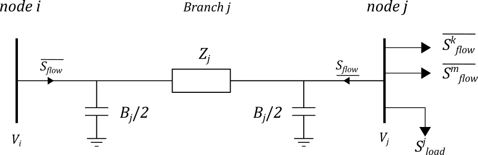

Introduction
=================

In `pandapower documentation <https://pandapower.readthedocs.io/en/v2.9.0/about/units.html#conventions>`_ , under *Signing System*, the sign depend if it's in consumer point of view or generator 
In this case, the edge is a branch, it can be considered as a consumer. Produced energy is negative and consumed energy is positive.

And the vector always enter in an equipment, the sign is determine as specified below.

The following :ref:`image <hv-connection>` is a schema of a PI DistFlow branch in a distribution network.

.. _hv-connection:

    PI DistFlow network schema
  
In Distflow Schema, the edge term is used to represent a branch, switch and transformer.

The equation :eq:`flow-upstream` is the active and reactive power inside the equipment from upstream node and :eq:`flow-downstream` from downstream node.

.. math::
    :label: flow-upstream
    :nowrap:
    
    \begin{align}
        \underline{S_{flow}^{i}}
    \end{align}

.. math::
    :label: flow-downstream
    :nowrap:
    
    \begin{align}
        \overline{S_{flow}^{j}}
    \end{align}

.. math::
    :label: flow-upstream-k
    :nowrap:
    
    \begin{align}
        \overline{S_{flow}^{k}}
    \end{align}    

.. math::
    :label: flow-upstream-m
    :nowrap:
    
    \begin{align}
        \overline{S_{flow}^{m}}
    \end{align}    

The term :math:`B` is the transversal element of the branch, it is positive for capacitance and negative for inductance.

.. .. math::
..     :label: flow-upstrea
..     :nowrap:
    
..     \begin{align}
..         {\frac{\partial V_{i}^{2}}{\partial P_\text{load}^{j}} = - 2 \cdot \displaystyle\sum_{k \in K} R_{k}
..     \end{align}

The parameter is defined as follows: 

+------------------------------------+----------------------------------------------------------------------+
| Term                               | Comment                                                              |
+====================================+======================================================================+
| .. math:: \underline{S_{flow}^{j}} | Active and reactive power inside the equipment from upstream node    |
+------------------------------------+----------------------------------------------------------------------+
| .. math:: \overline{S_{flow}^{j}}  | Active and reactive power inside the equipment from downstream node  |
+------------------------------------+----------------------------------------------------------------------+
